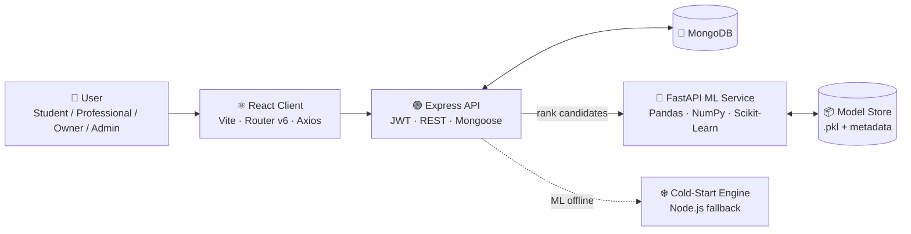

<div align="center">

# 🏠 PG Finder

### AI/ML-Powered Smart PG Accommodation Recommendation Platform

*Find the PG that fits your life — not just your distance filter.*


[Overview](#-overview) •
[Features](#-key-features) •
[Architecture](#-system-architecture) •
[AI Engine](#-ai--ml-recommendation-engine) •
[Quick Start](#-quick-start) •
[Roles](#-user-roles--capabilities) •
[Testing](#-testing--verification)

</div>

---

## 📖 Overview

Traditional PG search relies on a single dimension — **distance** or **price**. That produces poor results:

| Scenario | Traditional Search | PG Finder |
|---|---|---|
| PG at **300 m**, double your budget, no food or Wi-Fi | ✅ Ranked #1 | ❌ Ranked low |
| PG at **1.2 km**, within budget, AC + Food + Wi-Fi, ⭐ 4.8 | ❌ Buried | ✅ Ranked #1 |

**PG Finder** replaces naive filtering with a **multi-factor AI/ML recommendation engine** that scores every listing on **distance, rent fit, amenities, room sharing type, and tenant ratings** — simultaneously and personally.

### 🎯 Business Value

- **Students** reach the right PG faster, with transparent match explanations.
- **Working professionals** get recommendations tuned for commute, privacy, and comfort.
- **Owners** gain visibility to high-intent tenants and manage vacancies easily.
- **Admins** keep the platform trusted through verification, moderation, and ML governance.

---

## ✨ Key Features

| Area | Highlights |
|---|---|
| 🤖 **Smart Ranking** | Hybrid cold-start heuristic + supervised Random Forest model |
| 📊 **Explainable Results** | Match-percentage badges with reasons for every recommendation |
| 🧭 **Location Intelligence** | Search around colleges, offices, and IT parks using Haversine distance |
| 🔐 **Secure Access** | JWT authentication, bcrypt hashing, role-based authorization |
| 🛡️ **Zero-Downtime Fallback** | Express auto-switches to cold-start scoring if the ML service is offline |
| 📈 **ML Operations Center** | Model versioning, Precision@K / NDCG@K monitoring, one-click retraining |
| 📱 **Responsive UI** | Glassmorphism design, mobile-ready down to 360 px |

---

## 🏗️ System Architecture



### Technology Stack

| Layer | Technologies |
|---|---|
| **Frontend** | React.js (Vite), React Router v6, Axios, Lucide React, responsive Glassmorphism CSS |
| **Backend** | Node.js, Express.js, MongoDB (Mongoose), JWT, Bcrypt, REST APIs |
| **AI / ML** | Python 3.10+, FastAPI, Pandas, NumPy, Scikit-Learn (`RandomForestRegressor`), Joblib |

---

## 🧠 AI / ML Recommendation Engine

### Phase 1 — Cold-Start Heuristic Engine

Used when interaction history is limited. Each candidate PG receives a weighted score:

$$\text{Recommendation Score} = w_1 \cdot \text{distance\_score} + w_2 \cdot \text{price\_fit\_score} + w_3 \cdot \text{amenity\_match\_pct} + w_4 \cdot \text{rating\_score}$$

| Component | Definition |
|---|---|
| **Distance Decay** | $\text{distance\_score} = \dfrac{1.0}{1.0 + (\text{distance\_km} / 2.0)}$ |
| **Price Fit** | Checks lower & upper budget bounds with a graceful overflow penalty |
| **Amenity Match** | Percentage of selected required/preferred amenities the PG offers |
| **Rating Score** | $\text{rating} / 5.0$ |

### Phase 2 — Supervised Machine Learning

Activated as user interaction data accumulates.

```mermaid
flowchart TD
    A[User Interaction Events] --> B[Implicit Feedback Weighting]
    B --> C[18-Dimension Feature Matrix]
    C --> D[RandomForestRegressor]
    D --> E{Evaluate<br/>Precision@K · NDCG@K}
    E -- passes --> F[Deploy New Model Version]
    E -- fails --> G[Keep Previous Version]
    F --> H[Personalized Ranked Results]
```

**Implicit feedback weights**

| Event | `VIEW` | `CLICK` | `WISHLIST` | `REVIEW` | `ENQUIRY` |
|---|:---:|:---:|:---:|:---:|:---:|
| **Weight** | 1.0 | 1.5 | 3.0 | 4.0 | 5.0 |

**Pipeline**

1. Interaction signals are weighted by intent strength.
2. FastAPI builds an **18-dimensional feature matrix** per user–PG pair.
3. A `RandomForestRegressor` predicts candidate relevance.
4. **Precision@K** and **NDCG@K** are computed before any model is deployed.
5. If the ML service is unreachable, Express **automatically falls back** to cold-start scoring — no downtime.

---

## 👥 User Roles & Capabilities

<table>
<tr>
<td width="25%" valign="top">

### 🎓 Student
- Search PGs near a selected college / institute
- Set budget, AC / Non-AC, food, Wi-Fi, laundry & sharing preferences
- View ranked results with match % and explanations
- Save to wishlist & send enquiries

</td>
<td width="25%" valign="top">

### 💼 Professional
- Search PGs near office / company / IT park
- Filter for single private rooms, parking, power backup, AC & high ratings
- Get ML recommendations tuned for corporate employees

</td>
<td width="25%" valign="top">

### 🏢 PG Owner
- Add & manage PG properties *(admin-verified)*
- Toggle availability: `Available` / `Full`
- View tenant enquiries and reply directly

</td>
<td width="25%" valign="top">

### 🛡️ System Admin
- Dashboard overview stats
- Approve / reject pending listings
- Suspend, activate or delete users
- Manage cities & landmarks
- **ML Operations Center**: active model version, Precision@K & NDCG@K, retraining trigger

</td>
</tr>
</table>

---

## 📂 Project Structure

```
project/
├── client/                      # React Frontend (Vite)
│   └── src/
│       ├── components/          # Navbar, Footer, PGCard, RecommendationBadge, FilterSidebar, MapView
│       ├── context/             # AuthContext, CityContext
│       ├── pages/               # Home, SearchWizard, PGDetails, Wishlist, Enquiries,
│       │                        # Login, Register, OwnerDashboard, AdminDashboard
│       ├── services/            # api.js (Axios API client)
│       └── App.jsx
│
├── server/                      # Express Backend
│   ├── config/                  # db.js
│   ├── controllers/             # auth, pg, owner, admin, enquiry, wishlist, review, interaction
│   ├── middleware/              # authMiddleware (JWT & roles)
│   ├── models/                  # User, City, Landmark, PGListing, Review, Enquiry,
│   │                            # Wishlist, InteractionLog, ModelVersion
│   ├── routes/                  # REST endpoints
│   ├── services/                # mlClient.js, coldStartEngine.js
│   ├── scripts/                 # seed.js, testApi.js
│   └── server.js
│
├── ml-service/                  # Python FastAPI ML Engine
│   ├── app/
│   │   ├── main.py              # FastAPI endpoints
│   │   ├── cold_start.py        # Python fallback scoring
│   │   ├── feature_engineering.py
│   │   ├── train_model.py       # Trainer with Precision@K & NDCG@K
│   │   └── model_manager.py     # Serialization & versioning
│   ├── models/                  # Saved artifacts (.pkl + metadata)
│   └── requirements.txt
│
├── package.json
└── README.md
```

---

## 🚀 Quick Start

### Prerequisites

| Tool | Version |
|---|---|
| Node.js | 18+ |
| Python | 3.10+ |
| MongoDB | Local instance or Atlas URI |

### 1️⃣ Install Dependencies

```bash
# Root, backend and frontend packages
npm run install:all
```

### 2️⃣ Install ML Service Dependencies

```bash
cd ml-service
pip install -r requirements.txt
```

### 3️⃣ Seed the Database

```bash
npm run seed
```

> Populates **5 cities, 10 landmarks, demo accounts for every role, 30+ PG listings, reviews, and 60 interaction logs.**

### 4️⃣ Run All Services

| Terminal | Service | Command | Port |
|:---:|---|---|:---:|
| 1 | Express Backend | `npm run server` | `5000` |
| 2 | Python ML Service | `cd ml-service && uvicorn app.main:app --reload --port 8000` | `8000` |
| 3 | React Frontend | `npm run client` | `5173` |

Open **http://localhost:5173** 🎉

---

## 🔑 Demo Credentials

| Role | Email | Password |
|---|---|---|
| 🛡️ **System Admin** | `admin@pgfinder.com` | `admin123` |
| 🏢 **PG Owner 1** | `owner1@pgfinder.com` | `owner123` |
| 🏢 **PG Owner 2** | `owner2@pgfinder.com` | `owner123` |
| 🎓 **Student** | `student1@pgfinder.com` | `student123` |
| 💼 **Working Professional** | `pro1@pgfinder.com` | `pro123` |

> ⚠️ **Demo data only.** Change all credentials and secrets before any real deployment.

---

## 🧪 Testing & Verification

```bash
npm test
```

The internal test suite validates:

- ✅ **Haversine distance** calculation accuracy
- ✅ **Ranking correctness** — a slightly farther PG with better budget & amenity fit scores **higher** than a closer, expensive PG

---

## 🔒 Security & Reliability

| Concern | Approach |
|---|---|
| Authentication | Stateless JWT tokens |
| Password storage | Bcrypt hashing |
| Authorization | Role-based middleware (`student`, `professional`, `owner`, `admin`) |
| Listing quality | Admin approval before listings go public |
| Resilience | Automatic cold-start fallback when ML service is down |
| Model safety | Models deployed only after Precision@K / NDCG@K evaluation |

---

## 🗺️ Roadmap

- [ ] Real-time chat between tenants and owners
- [ ] Online booking & rent payment integration
- [ ] Interactive map clustering and commute-time routing
- [ ] Collaborative filtering and embedding-based recommendations
- [ ] Notification system (email / push) for enquiry replies

---

## 🤝 Contributing

1. Fork the repository
2. Create a feature branch: `git checkout -b feature/your-feature`
3. Commit your changes: `git commit -m "feat: add your feature"`
4. Push the branch: `git push origin feature/your-feature`
5. Open a Pull Request

---

<div align="center">

**Built with ❤️ using React · Node.js · MongoDB · FastAPI · Scikit-Learn**

⭐ *If you found this project useful, please consider giving it a star!* ⭐

</div>
