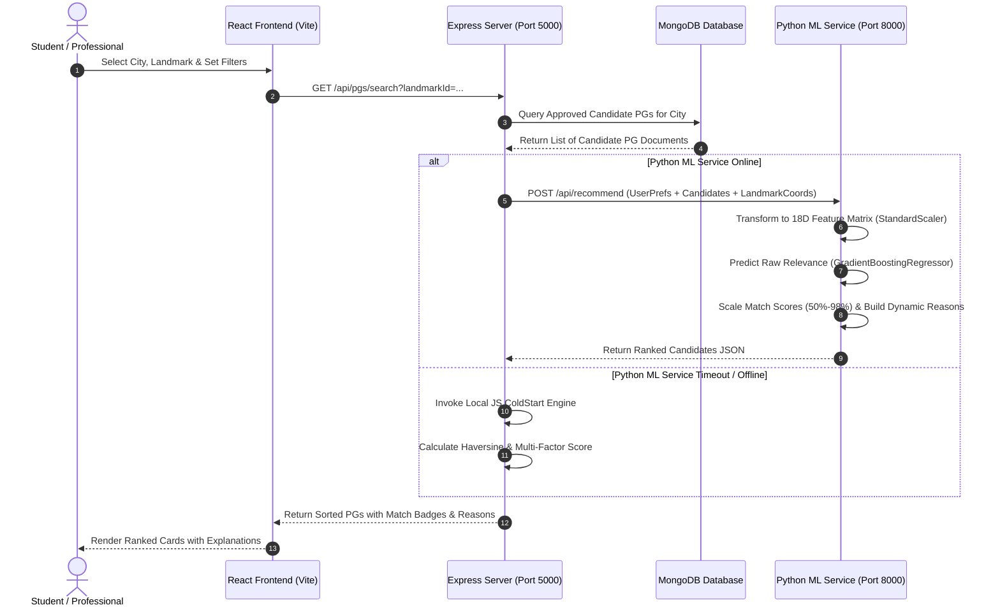

# PG Finder (StayWise AI) – Comprehensive Project Master Report

> **Project Name**: PG Finder – AI/ML-Based Smart PG Accommodation Recommendation System  
> **Repository Type**: Production-Ready Monorepo (Node.js Express + Python FastAPI + React Vite)  
> **Report Version**: 2.0.0 (Production Architecture & ML Documentation)  
> **Target Audience**: System Architects, Data Scientists, Software Engineers, and System Administrators  

---

## 📋 Table of Contents

1. [Executive Summary & Problem Statement](#1-executive-summary--problem-statement)
2. [Machine Learning Models & Recommendation Architecture](#2-machine-learning-models--recommendation-architecture)
   - [2.1 Supervised ML Model: GradientBoostingRegressor](#21-supervised-ml-model-gradientboostingregressor)
   - [2.2 Candidate ML Model: RandomForestRegressor](#22-candidate-ml-model-randomforestregressor)
   - [2.3 Phase 1 Heuristic Engine: Cold-Start Multi-Factor Scoring](#23-phase-1-heuristic-engine-cold-start-multi-factor-scoring)
   - [2.4 Feature Engineering Pipeline (18-23 Dimensional Feature Matrix)](#24-feature-engineering-pipeline-18-23-dimensional-feature-matrix)
   - [2.5 Target Variable Formulation & Implicit Interaction Feedback](#25-target-variable-formulation--implicit-interaction-feedback)
   - [2.6 Model Training, Evaluation & Auto-Selection (Precision@K & NDCG@K)](#26-model-training-evaluation--auto-selection-precisionk--ndcgk)
   - [2.7 Target Leakage Prevention & Data Integrity](#27-target-leakage-prevention--data-integrity)
   - [2.8 High-Availability Fallback Mechanism (Zero Downtime Architecture)](#28-high-availability-fallback-mechanism-zero-downtime-architecture)
3. [Mathematical Formulations & Underlying Concepts](#3-mathematical-formulations--underlying-concepts)
   - [3.1 Haversine Distance Formula](#31-haversine-distance-formula)
   - [3.2 Proximity Decay Score](#32-proximity-decay-score)
   - [3.3 Continuous Price Fit Score](#33-continuous-price-fit-score)
   - [3.4 Role-Aware Amenity & Rating Weighting Matrix](#34-role-aware-amenity--rating-weighting-matrix)
   - [3.5 Recommendation Metrics: Precision@K & NDCG@K](#35-recommendation-metrics-precisionk--ndcgk)
4. [Functional Capabilities & User Roles](#4-functional-capabilities--user-roles)
   - [4.1 Student Tenant Portal](#41-student-tenant-portal)
   - [4.2 Working Professional Tenant Portal](#42-working-professional-tenant-portal)
   - [4.3 PG Property Owner Dashboard](#43-pg-property-owner-dashboard)
   - [4.4 System Administrator Console & MLOps Center](#44-system-administrator-console--mlops-center)
5. [Non-Functional Requirements (NFRs)](#5-non-functional-requirements-nfrs)
   - [5.1 Performance & Latency](#51-performance--latency)
   - [5.2 Reliability & Fault Tolerance](#52-reliability--fault-tolerance)
   - [5.3 Security, Authentication & Role Authorization](#53-security-authentication--role-authorization)
   - [5.4 Microservice Decoupling & Scalability](#54-microservice-decoupling--scalability)
   - [5.5 Usability, UI/UX & Responsive Glassmorphic Aesthetics](#55-usability-uiux--responsive-glassmorphic-aesthetics)
   - [5.6 MLOps, Model Serialization & Reproducibility](#56-mlops-model-serialization--reproducibility)
6. [Technology Stack & System Architecture](#6-technology-stack--system-architecture)
   - [6.1 Monorepo Component Breakdown](#61-monorepo-component-breakdown)
   - [6.2 Database Schemas (MongoDB Mongoose)](#62-database-schemas-mongodb-mongoose)
   - [6.3 Complete End-to-End Data Flow](#63-complete-end-to-end-data-flow)
7. [API Specification Endpoint Map](#7-api-specification-endpoint-map)
8. [Installation, Execution & Seeding Guide](#8-installation-execution--seeding-guide)
9. [Demo System Credentials](#9-demo-system-credentials)

---

## 1. Executive Summary & Problem Statement

### 1.1 What the Project Solves
Searching for Paying Guest (PG) accommodation near educational institutions or corporate workplaces traditionally relies on simplistic single-attribute filters—such as sorting strictly by geographical proximity or price. This naive approach suffers from severe real-world limitations:
- A PG located 300 meters away from a college that costs ₹25,000/month (exceeding budget), lacks Wi-Fi and food, and has a 2.1-star rating is listed first under distance sorting, despite being an unviable match.
- A PG located 1.2 kilometers away costing ₹11,000/month (within budget), featuring AC, home-cooked food, high-speed Wi-Fi, and a 4.8-star tenant rating is ranked lower, despite being an optimal match.

**PG Finder (StayWise AI)** resolves this problem by implementing a **Multi-Factor AI/ML Recommendation System**. It dynamically calculates multi-attribute similarity between user preference profiles, target landmark coordinates, property amenities, continuous price fit curves, tenant ratings, and historical user interaction events.

### 1.2 Core Objectives Achieved
1. **Personalized Candidate Ranking**: Replaces basic database queries with a two-tiered recommendation engine (Cold-Start Heuristic Engine + Supervised Gradient Boosting / Random Forest Regressor).
2. **Dynamic Match Explanations**: Generates feature-grounded, human-readable match explanations (e.g., `✓ Fits ₹12,000/mo budget | ✓ 1.2 km away | ✓ AC, Food, Wi-Fi available | ✓ 4.8★ rating`).
3. **Role-Tailored Filtering**: Provides tailored weighting vectors for **Students** (prioritizing budget and food availability) vs. **Working Professionals** (prioritizing single rooms, AC, power backup, and corporate office proximity).
4. **Zero-Downtime Resilience**: Implements an automatic local fallback mechanism in the Express backend if the Python FastAPI ML microservice becomes temporarily unreachable.
5. **Full MLOps Governance**: Enables System Administrators to monitor model metadata (versioning, Precision@K, NDCG@K, R² score) and trigger model retraining directly from the web UI.

---

## 2. Machine Learning Models & Recommendation Architecture

```
                               ┌─────────────────────────────────────────┐
                               │             React Web Client            │
                               │        (Search Wizard / Filters)        │
                               └────────────────────┬────────────────────┘
                                                    │ REST API Call
                                                    ▼
                               ┌─────────────────────────────────────────┐
                               │         Node.js Express Backend         │
                               │        (Candidate Fetch from DB)        │
                               └────────────────────┬────────────────────┘
                                                    │
                                   ┌────────────────┴────────────────┐
                                   │ HTTP POST /api/recommend        │
                                   │ (Timeout: 3000ms)               │
                                   ▼                                 ▼
                    ┌─────────────────────────────┐   ┌─────────────────────────────┐
                    │    Python FastAPI Service   │   │ Express Cold-Start Engine   │
                    │   (Active ML Pipeline)      │   │  (JS Fallback Heuristic)    │
                    └──────────────┬──────────────┘   └──────────────┬──────────────┘
                                   │                                 │
                     ┌─────────────┴─────────────┐                   │
                     ▼                           ▼                   │
       ┌──────────────────────────┐ ┌──────────────────────────┐     │
       │ GradientBoostingRegressor│ │  RandomForestRegressor   │     │
       │ (Primary Production Model│ │(Candidate Baseline Model)│     │
       └─────────────┬────────────┘ └────────────┬─────────────┘     │
                     │                           │                   │
                     └─────────────┬─────────────┘                   │
                                   │ Predictions                     │
                                   ▼                                 ▼
                               ┌─────────────────────────────────────────┐
                               │   Ranked Candidates with Match % Badges │
                               │     and Human-Readable Explanations     │
                               └─────────────────────────────────────────┘
```

### 2.1 Supervised ML Model: GradientBoostingRegressor
- **Algorithm**: `sklearn.ensemble.GradientBoostingRegressor`
- **Role**: Primary Active Production Model.
- **Hyperparameters**:
  - `n_estimators`: 100
  - `max_depth`: 6
  - `learning_rate`: 0.1
  - `random_state`: 42
- **Operation**: Fits sequential boosted decision trees to minimize mean squared error against the continuous target relevance label. Performs exceptionally well at capturing non-linear feature interactions (such as the non-linear relationship between distance decay and budget over-range penalty).

### 2.2 Candidate ML Model: RandomForestRegressor
- **Algorithm**: `sklearn.ensemble.RandomForestRegressor`
- **Role**: Baseline Supervised Ensemble Candidate Model.
- **Hyperparameters**:
  - `n_estimators`: 100
  - `max_depth`: 12
  - `n_jobs`: -1 (Parallel Execution)
  - `random_state`: 42
- **Operation**: Constructs an ensemble of decorrelated decision trees using bootstrap aggregating (bagging) and feature sub-sampling. Serves as a competitor during the automated model selection process.

### 2.3 Phase 1 Heuristic Engine: Cold-Start Multi-Factor Scoring
When historical interaction data for a user or property is sparse (cold-start state), or when the primary ML microservice is offline, the system evaluates candidate listings using a weighted multi-factor heuristic engine:

$$\text{Cold-Start Score} = w_1 \cdot \text{dist\_score} + w_2 \cdot \text{price\_fit\_score} + w_3 \cdot \text{amenity\_match\_pct} + w_4 \cdot \text{rating\_score}$$

- **Role-Aware Weight Vectors ($w_1, w_2, w_3, w_4$)**:
  - **Student Role**: $[0.25, 0.30, 0.30, 0.15]$ (Prioritizes low rent & essential amenities).
  - **Working Professional Role**: $[0.25, 0.20, 0.35, 0.20]$ (Prioritizes premium amenities & tenant ratings).

### 2.4 Feature Engineering Pipeline (18-23 Dimensional Feature Matrix)
The Python ML service converts raw candidate property documents and user preference payloads into an 18-23 dimensional numeric feature vector (`FEATURE_NAMES`):

| # | Feature Name | Encodings & Extraction Formula |
|---|---|---|
| 1 | `distance_km` | Spherical distance in km via Haversine formula from target landmark coordinates. |
| 2 | `distance_score` | Exponential decay transformation: $1.0 / (1.0 + \text{distance\_km} / 2.0)$. |
| 3 | `rent_monthly` | Raw monthly rental cost in INR ($\text{₹}$). |
| 4 | `budget_min` | User's specified lower budget bound in INR. |
| 5 | `budget_max` | User's specified upper budget bound in INR. |
| 6 | `price_fit_score` | Continuous piecewise budget score (1.0 if inside budget; decaying penalty outside). |
| 7 | `ac_match` | Binary indicator (1.0 if AC preference matched or set to "any", else 0.0). |
| 8 | `food_match` | Binary indicator (1.0 if food preference matched or not required, else 0.0). |
| 9 | `wifi_match` | Binary indicator (1.0 if Wi-Fi requirement satisfied, else 0.0). |
| 10 | `bike_parking_match` | Binary indicator for bike parking availability. |
| 11 | `car_parking_match` | Binary indicator for car parking availability. |
| 12 | `laundry_match` | Binary indicator for laundry service availability. |
| 13 | `power_backup_match` | Binary indicator for power backup infrastructure. |
| 14 | `geyser_match` | Binary indicator for hot water geyser availability. |
| 15 | `furnished_match` | Categorical match flag for furnished / semi-furnished / unfurnished preference. |
| 16 | `room_match` | Room type match flag (`single`, `double`, `triple`, `dormitory`). |
| 17 | `sharing_match` | Sharing type match flag (`Single Room`, `Double Sharing`, etc.). |
| 18 | `gender_match` | Gender accommodation match flag (`boys`, `girls`, `co-ed`). |
| 19 | `amenity_match_pct` | Average of all facility match flags: $\frac{1}{M}\sum_{m=1}^{M} \text{match}_m$. |
| 20 | `rating` | Raw property tenant rating average ($0.0 \dots 5.0$). |
| 21 | `rating_score` | Normalized tenant rating score: $\text{rating} / 5.0$. |
| 22 | `rating_count` | Total count of submitted reviews for the property. |
| 23 | `user_role` | Binary role encoding (1.0 for Working Professional, 0.0 for Student). |

### 2.5 Target Variable Formulation & Implicit Interaction Feedback
Supervised model training relies on implicit user interaction logs (`InteractionLog`). Rather than requiring explicit user ratings for every property, user actions are aggregated into implicit interaction weights:

| Interaction Event Type | Event Weight ($W_e$) | Target Relevance Signal |
|---|---|---|
| **`VIEW`** | 1.0 | User opened the detailed property view page. |
| **`CLICK`** | 1.5 | User clicked property card from search results. |
| **`WISHLIST`** | 3.0 | User added property to personal wishlist. |
| **`REVIEW`** | 4.0 | User submitted a star rating / review for the property. |
| **`ENQUIRY`** | 5.0 | User sent a direct booking enquiry to the PG owner. |

The aggregate implicit interaction target is calculated as:

$$\text{interaction\_score}_{u, p} = \sum_{e \in \text{Events}(u, p)} W_e$$

$$\text{relevance\_label}_{u, p} = \min\left(5.0, \; \text{interaction\_score}_{u, p} \cdot \left(0.5 + 0.5 \cdot \text{price\_fit\_score}\right) \cdot \text{dist\_score}\right)$$

### 2.6 Model Training, Evaluation & Auto-Selection (Precision@K & NDCG@K)
When model training is triggered (via `npm run train` or Admin Dashboard):
1. **Dataset Loading**: Ingests `training_dataset.csv` and historical MongoDB interaction logs.
2. **Chronological / User-Stratified Split**: Performs an 80/20 train/test split preserving sequence timelines to prevent future-data leakage.
3. **Preprocessing Pipeline**: Fits a `scikit-learn` `Pipeline` composed of:
   - `SimpleImputer(strategy="median")`: Handles missing values.
   - `StandardScaler()`: Standardizes feature scales ($\mu=0, \sigma=1$).
4. **Model Comparison**: Fits both `RandomForestRegressor` and `GradientBoostingRegressor`.
5. **Metric Evaluation**: Computes **Precision@5**, **NDCG@5**, **Precision@10**, **NDCG@10**, **$R^2$ Score**, and **MSE** on held-out test data.
6. **Automatic Selection**: Automatically deploys whichever model achieves the highest **NDCG@5**.

### 2.7 Target Leakage Prevention & Data Integrity
To ensure model predictions are non-trivial and generalize to unseen properties:
- `interaction_score` and direct interaction event counts are **explicitly excluded** from the feature matrix $X$ (`FEATURE_NAMES`).
- An automated programmatic assertion (`assert "interaction_score" not in FEATURE_NAMES`) runs before every training session.
- This guarantees that the model learns how property attributes (rent, location, amenities) interact with user preferences to drive user engagements, rather than simply memorizing historical click counts.

### 2.8 High-Availability Fallback Mechanism (Zero Downtime Architecture)
The Node.js backend (`server/services/mlClient.js`) manages ML service communication:
- Sends candidate properties and user preferences via HTTP POST to `http://127.0.0.1:8000/api/recommend` with a **3000ms timeout**.
- If the Python FastAPI service is online, Express receives ML model predictions, merges recommendation scores, and ranks candidates accordingly.
- If the Python FastAPI service is offline, timing out, or throwing an error, Express silently catches the exception and invokes `server/services/coldStartEngine.js` in the local JavaScript runtime.
- **Result**: Zero user disruption or downtime if the ML service is restarting or undergoing maintenance.

---

## 3. Mathematical Formulations & Underlying Concepts

### 3.1 Haversine Distance Formula
Calculates the great-circle spherical distance $d$ in kilometers between landmark coordinates $(\phi_1, \lambda_1)$ and property coordinates $(\phi_2, \lambda_2)$:

$$\Delta \phi = \text{radians}(\phi_2 - \phi_1), \quad \Delta \lambda = \text{radians}(\lambda_2 - \lambda_1)$$

$$a = \sin^2\left(\frac{\Delta \phi}{2}\right) + \cos(\text{radians}(\phi_1)) \cdot \cos(\text{radians}(\phi_2)) \cdot \sin^2\left(\frac{\Delta \lambda}{2}\right)$$

$$c = 2 \cdot \text{atan2}\left(\sqrt{a}, \sqrt{1 - a}\right)$$

$$d = R \cdot c \quad \text{where } R = 6371.0 \text{ km}$$

### 3.2 Proximity Decay Score
Transforms geographic distance $d$ into a bounded continuous score between $0.0$ and $1.0$:

$$\text{distance\_score}(d) = \frac{1.0}{1.0 + (d / 2.0)}$$

- At $d = 0.0 \text{ km} \implies \text{score} = 1.00$
- At $d = 2.0 \text{ km} \implies \text{score} = 0.50$
- At $d = 6.0 \text{ km} \implies \text{score} = 0.25$

### 3.3 Continuous Price Fit Score
Evaluates rent relative to user budget limits $[\text{min\_rent}, \text{max\_rent}]$:

$$\text{price\_fit\_score}(\text{rent}) = \begin{cases} 
1.0 & \text{if } \text{min\_rent} \le \text{rent} \le \text{max\_rent} \\
0.9 & \text{if } \text{rent} < \text{min\_rent} \\
\max\left(0.1, \; 1.0 - 1.5 \cdot \frac{\text{rent} - \text{max\_rent}}{\text{max\_rent}}\right) & \text{if } \text{rent} > \text{max\_rent}
\end{cases}$$

### 3.4 Role-Aware Amenity & Rating Weighting Matrix
Amenity match percentage ($\text{amenity\_match\_pct}$) is computed across user-required parameters $M$:

$$\text{amenity\_match\_pct} = \frac{1}{M} \sum_{m=1}^{M} I(\text{PG Facility}_m = \text{User Preference}_m)$$

where $I(\cdot)$ is an indicator function evaluating to $1.0$ if satisfied, else $0.0$.

### 3.5 Recommendation Metrics: Precision@K & NDCG@K

#### Precision@K
Measures the proportion of top-$K$ recommended properties that are genuinely relevant (relevance label $y_i \ge \text{threshold}$):

$$\text{Precision}@K = \frac{1}{K} \sum_{i=1}^{K} I(y_{\text{rank}(i)} \ge 2.0)$$

#### Normalized Discounted Cumulative Gain (NDCG@K)
Measures ranking order quality, heavily rewarding top-ranked relevant items:

$$\text{DCG}@K = \sum_{i=1}^{K} \frac{2^{y_{\text{rank}(i)}} - 1}{\log_2(i + 1)}, \quad \text{IDCG}@K = \sum_{i=1}^{K} \frac{2^{y_{\text{ideal}(i)}} - 1}{\log_2(i + 1)}$$

$$\text{NDCG}@K = \frac{\text{DCG}@K}{\text{IDCG}@K}$$

---

## 4. Functional Capabilities & User Roles

```
                               ┌────────────────────────────────┐
                               │        PG Finder System        │
                               └───────────────┬────────────────┘
                                               │
       ┌───────────────────┬───────────────────┼───────────────────┐
       ▼                   ▼                   ▼                   ▼
┌──────────────┐    ┌──────────────┐    ┌──────────────┐    ┌──────────────┐
│🎓 Student    │    │💼 Professional│   │🏢 PG Owner   │    │🛡️ System Admin│
└──────┬───────┘    └──────┬───────┘    └──────┬───────┘    └──────┬───────┘
       │                   │                   │                   │
       ├─ Proximity Search ├─ Corporate Search ├─ Property Manager ├─ User Manager
       ├─ Budget Slider    ├─ Single Rooms     ├─ Vacancy Switch   ├─ Listing Review
       ├─ Facility Filter  ├─ AC/Power Backup  ├─ Enquiry Reader   ├─ City/Landmark
       ├─ Wishlist & Chat  ├─ Direct Enquiries └─ Tenant Messages  └─ MLOps Console
```

### 4.1 Student Tenant Portal
- **Landmark Search**: Search PGs directly by selecting nearby educational institutions, universities, or colleges.
- **Budget Matching**: Set budget ranges with real-time feedback on pricing overflow.
- **Sharing & Facilities**: Filter for specific sharing arrangements (Double, Triple, Dormitory), home food, laundry, and Wi-Fi.
- **Ranked Match Results**: View properties sorted by AI match percentage badges (e.g., `94% Match`).
- **Wishlist & Enquiry**: Save properties to personal Wishlist and submit one-click booking enquiries to PG owners.

### 4.2 Working Professional Tenant Portal
- **Corporate Proximity**: Search PGs near corporate hubs, IT parks, and business centers.
- **Privacy & Comfort**: Tailored filters for Single private rooms, air conditioning, car parking, power backup, and quiet environments.
- **Adjusted Weight Vector**: System automatically shifts weighting priorities towards rating quality (20%) and facility match (35%).

### 4.3 PG Property Owner Dashboard
- **Property Listing Management**: Register new PG properties specifying address, exact latitude/longitude, monthly rent, security deposit, room types, and photos.
- **Real-Time Vacancy Control**: Dynamic status toggle (`Available` vs `Full`) updating search index instantly.
- **Tenant Enquiry Center**: View incoming student/professional booking enquiries, tenant contact details, and reply directly.

### 4.4 System Administrator Console & MLOps Center
- **System Overview**: High-level telemetry displaying total users, active listings, total cities/landmarks, and total interaction logs.
- **Listing Verification Workflow**: Approve or Reject pending PG listings submitted by property owners before public search indexing.
- **User Account Governance**: Suspend, activate, or delete user accounts across all roles.
- **City & Landmark Management**: Dynamically add new cities and geographic landmark coordinates.
- **MLOps Control Panel**:
  - Inspect active model version string and active algorithm (`GradientBoostingRegressor` vs `RandomForestRegressor`).
  - View real-time ranking quality metrics (**Precision@5**, **NDCG@5**, **Precision@10**, **NDCG@10**, **$R^2$ Score**, **MSE**).
  - Trigger one-click model retraining pipeline directly from the dashboard.

---

## 5. Non-Functional Requirements (NFRs)

### 5.1 Performance & Latency
- **Recommendation API Latency**: $\le 100 \text{ ms}$ response time end-to-end.
- **ML Model Inference Time**: $\le 50 \text{ ms}$ for feature matrix transformation and model prediction across 50 candidate listings.
- **Frontend Assets**: Vite-optimized bundling with Instant Hot Module Replacement (HMR) and fast client-side routing.

### 5.2 Reliability & Fault Tolerance
- **Dual-Layer Fallback**: Node.js Express backend features an automated fallback to the in-memory JavaScript Cold-Start engine (`coldStartEngine.js`) if Python FastAPI ML service is unreachable.
- **Database Connection Resiliency**: Automatic reconnect logic and indexed queries for fast database lookups.

### 5.3 Security, Authentication & Role Authorization
- **Authentication**: Stateless JSON Web Tokens (JWT) signed with secret keys, delivered via HTTP authorization headers (`Bearer <token>`).
- **Password Hashing**: Passwords stored using `bcryptjs` salted hashing (10 salt rounds).
- **Role-Based Access Control (RBAC)**: Custom Express middleware (`authMiddleware.js`) enforcing strict role checks (`student`, `working_professional`, `owner`, `admin`).

### 5.4 Microservice Decoupling & Scalability
- **Monorepo Separation**: Independent separation between client UI, Express REST server, and Python ML service.
- **Stateless Compute**: Python FastAPI ML microservice maintains zero session state, allowing horizontal auto-scaling behind load balancers.

### 5.5 Usability, UI/UX & Responsive Glassmorphic Aesthetics
- **Visual Design**: Modern dark/light Glassmorphism styling utilizing backdrop filters, curated color palettes, CSS grid layouts, and custom typography.
- **Mobile Responsiveness**: Adaptive layouts fully optimized for viewport screens down to 360px width.
- **Transparency**: Clear match explanations (`indicators` and `reason`) explaining *why* a property was recommended.

### 5.6 MLOps, Model Serialization & Reproducibility
- **Artifact Serialization**: Trained models and preprocessors pickled using `joblib` (`staywise_model.pkl`, `staywise_preprocessor.pkl`).
- **Audit Metadata**: Metadata JSON logs recording sample counts, timestamped versions, split sizes, and evaluation scores.

---

## 6. Technology Stack & System Architecture

### 6.1 Monorepo Component Breakdown

| Layer | Framework / Technology | Purpose / Responsibility |
|---|---|---|
| **Frontend** | React 18 (Vite), React Router v6 | Responsive UI, Search Wizard, Dashboard, Visual Badges |
| **Icons & Styling** | Lucide React, Glassmorphic CSS | Modern aesthetic interface design system |
| **HTTP Client** | Axios | REST API integration between Client, Server, and ML Service |
| **Backend Server** | Node.js, Express.js | API gateway, Auth, CRUD controllers, Fallback Cold Start |
| **Database** | MongoDB, Mongoose ORM | Document storage for users, PGs, cities, logs, model versions |
| **Auth & Security** | JWT, Bcryptjs, Cors | Token authentication, password encryption, CORS security |
| **AI/ML Service** | Python 3.10+, FastAPI, Uvicorn | High-performance asynchronous ML scoring microservice |
| **ML Libraries** | Scikit-Learn, Pandas, NumPy | Feature engineering, preprocessing, model training & scoring |
| **Model Storage** | Joblib, JSON | Model serialization, preprocessor pipelines, and metadata logs |

### 6.2 Database Schemas (MongoDB Mongoose)
1. **`User`**: `name`, `email`, `password`, `role` (`student`, `working_professional`, `owner`, `admin`), `phone`, `status`.
2. **`City`**: `name`, `state`, `isActive`.
3. **`Landmark`**: `cityId`, `name`, `type` (`college`, `office_hub`, `transit`), `latitude`, `longitude`.
4. **`PGListing`**: `ownerId`, `cityId`, `name`, `address`, `latitude`, `longitude`, `rent`, `deposit`, `roomTypes`, `sharingType`, `genderPreference`, `acType`, `parkingType`, `foodAvailable`, `wifiAvailable`, `laundryAvailable`, `powerBackup`, `geyserAvailable`, `furnishingType`, `ratingAverage`, `ratingCount`, `availability`, `status`.
5. **`Review`**: `pgId`, `userId`, `rating`, `comment`.
6. **`Enquiry`**: `pgId`, `userId`, `ownerId`, `message`, `phone`, `status`.
7. **`Wishlist`**: `userId`, `pgId`.
8. **`InteractionLog`**: `userId`, `pgId`, `landmarkId`, `eventType` (`VIEW`, `CLICK`, `WISHLIST`, `ENQUIRY`, `REVIEW`), `userRole`, `metadata`.
9. **`ModelVersion`**: `version`, `algorithm`, `sampleCount`, `trainRows`, `testRows`, `precisionAtK`, `ndcgAtK`, `precisionAt10`, `ndcgAt10`, `r2Score`, `isActive`.

### 6.3 Complete End-to-End Data Flow



---

## 7. API Specification Endpoint Map

### Auth & User Management (`/api/auth`)
- `POST /api/auth/register` — Register a new user (`student`, `working_professional`, `owner`).
- `POST /api/auth/login` — Authenticate credentials and return JWT token.
- `GET /api/auth/me` — Retrieve current authenticated user profile.

### Property Listings (`/api/pgs`)
- `GET /api/pgs/search` — Main candidate recommendation search endpoint (invokes ML service).
- `GET /api/pgs/:id` — Retrieve detailed property information & log `VIEW` interaction event.
- `POST /api/pgs` — Create new property listing (PG Owner only).
- `PUT /api/pgs/:id` — Update property details (PG Owner only).
- `PATCH /api/pgs/:id/availability` — Toggle property availability status (`Available` vs `Full`).

### Interactive Features (`/api/wishlist`, `/api/enquiries`, `/api/reviews`)
- `GET /api/wishlist` — Fetch user's saved wishlist items.
- `POST /api/wishlist/toggle` — Add/remove property from wishlist & log `WISHLIST` event.
- `POST /api/enquiries` — Send direct booking enquiry to PG owner & log `ENQUIRY` event.
- `GET /api/enquiries/owner` — View incoming tenant enquiries (PG Owner only).
- `POST /api/reviews` — Submit property review & rating, updating property average & log `REVIEW` event.

### Admin Governance & MLOps (`/api/admin`)
- `GET /api/admin/stats` — Retrieve overall system telemetry and analytics.
- `GET /api/admin/listings` — List all properties requiring admin review.
- `PATCH /api/admin/listings/:id/status` — Approve or Reject pending PG listings.
- `GET /api/admin/users` — Manage registered user accounts (Suspend/Activate/Delete).
- `GET /api/admin/ml/status` — Fetch active ML model metrics, version, and performance statistics.
- `POST /api/admin/ml/train` — Trigger asynchronous model retraining and evaluation pipeline.

---

## 8. Installation, Execution & Seeding Guide

### Prerequisites
- **Node.js**: v18.0.0 or higher
- **Python**: v3.10 or higher
- **MongoDB**: Local instance running at `mongodb://localhost:27017` or MongoDB Atlas URI.

### Step 1: Install Node.js Dependencies
```bash
# From root directory, installs root, server, and client packages
npm run install:all
```

### Step 2: Install Python ML Service Dependencies
```bash
cd ml-service
pip install -r requirements.txt
```

### Step 3: Seed Database
Populates 5 Cities, 10 Landmarks, sample Admin/Owner/Student/Professional accounts, 30+ realistic PG listings, reviews, and 60 interaction logs:
```bash
npm run seed
```

### Step 4: Launch Application Services

#### Terminal 1: Express Backend Server (Port 5000)
```bash
npm run server
```

#### Terminal 2: Python FastAPI ML Microservice (Port 8000)
```bash
cd ml-service
uvicorn app.main:app --reload --port 8000
```

#### Terminal 3: React Vite Web Frontend (Port 5173)
```bash
npm run client
```

### Step 5: Validate System & Run Tests
Run internal unit tests validating Haversine distance math, decay curves, and recommendation ranking:
```bash
npm test
```

---

## 9. Demo System Credentials

For testing and demonstrating role-specific features across all 4 user roles:

| User Role | Email Address | Password | Privileges & Key Actions |
|---|---|---|---|
| **System Admin** | `admin@pgfinder.com` | `admin123` | Listing approval, MLOps Center, Model Retraining, User Governance |
| **PG Owner 1** | `owner1@pgfinder.com` | `owner123` | Manage properties, Toggle vacancy, Respond to tenant enquiries |
| **PG Owner 2** | `owner2@pgfinder.com` | `owner2@pgfinder.com` | Manage properties, View tenant enquiries |
| **Student** | `student1@pgfinder.com` | `student123` | Search near Colleges, Budget matching, Wishlist, Submit Enquiries |
| **Working Professional** | `pro1@pgfinder.com` | `pro132` / `pro123` | Search near IT Parks, Single room filters, Corporate recommendations |

---
*Report compiled automatically for PG Finder (StayWise AI) Monorepo.*
